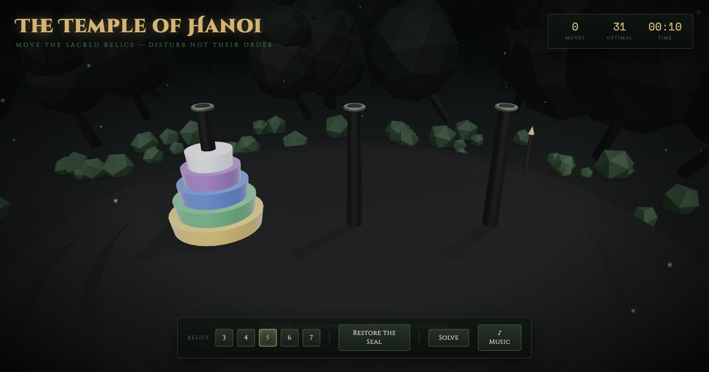

# The Temple of Hanoi

A playable Towers of Hanoi game rendered in 3D with Three.js, themed as a lost jungle temple: a stone dais and carved pegs surrounded by dark jungle silhouettes, drifting fireflies, and flickering torchlight.



## Features

- Classic Towers of Hanoi rules for 3 to 7 relics (disks), each rendered as a distinct gem color (diamond, amethyst, sapphire, emerald, citrine, amber, ruby).
- Click a pillar to lift its topmost relic, click another to set it down; illegal moves are rejected with temple-flavored warnings.
- Live move counter, optimal-move count, and timer, plus a win screen when the seal is restored.
- **Solve** button — instantly computes the optimal solution from the current board state and plays it back automatically.
- **Music** toggle — an original ambient piece synthesized live in the browser (Web Audio API) from a Vietnamese folk pentatonic scale, played over a soft drone. No audio files are embedded.
- Orbit/zoom camera controls with a slow idle auto-rotate, a procedurally-generated jungle (instanced trees, mossy stone textures, fog) surrounding the scene on all sides, and no external image/texture assets — everything is generated at runtime.

## Running it

The page uses ES module imports and must be served over HTTP rather than opened directly as a `file://` URL:

```
python3 -m http.server 8787
```

Then open `http://localhost:8787/index.html` in a browser.

## Tech

A single self-contained `index.html` — no build system, package manager, or dependencies beyond Three.js, loaded from a CDN via an import map.
